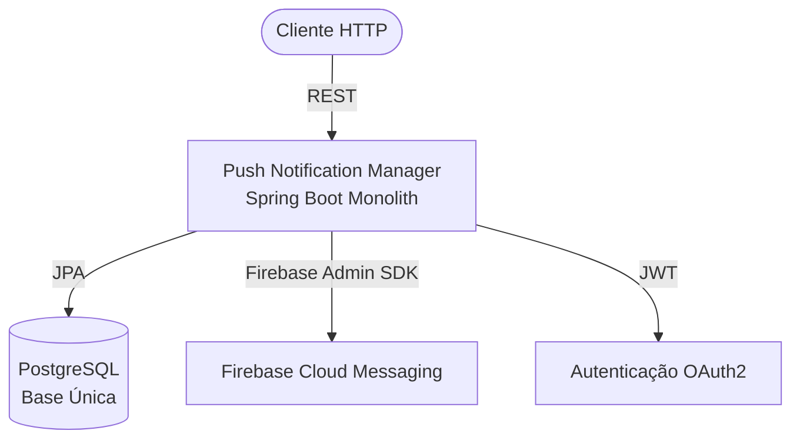
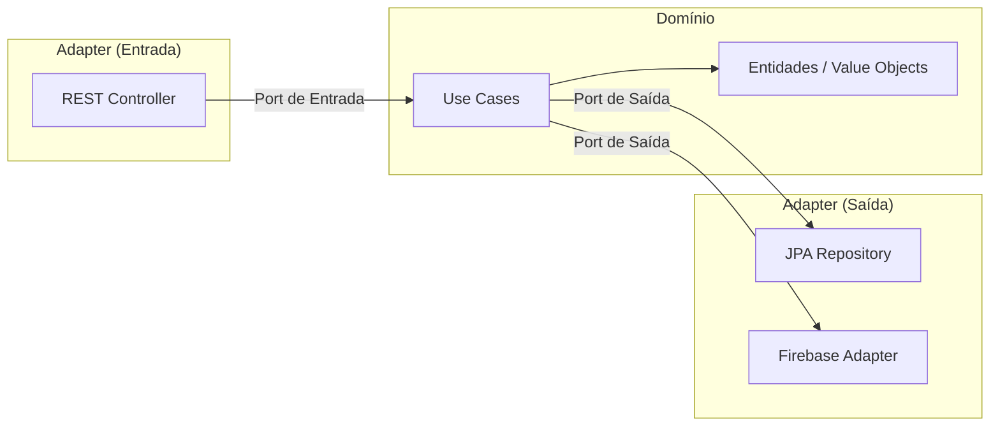
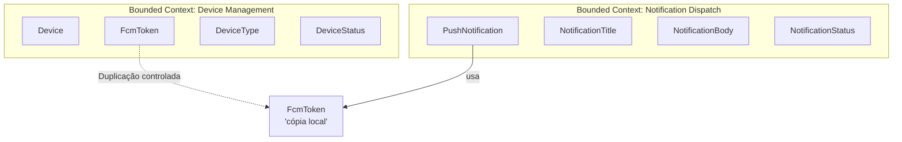
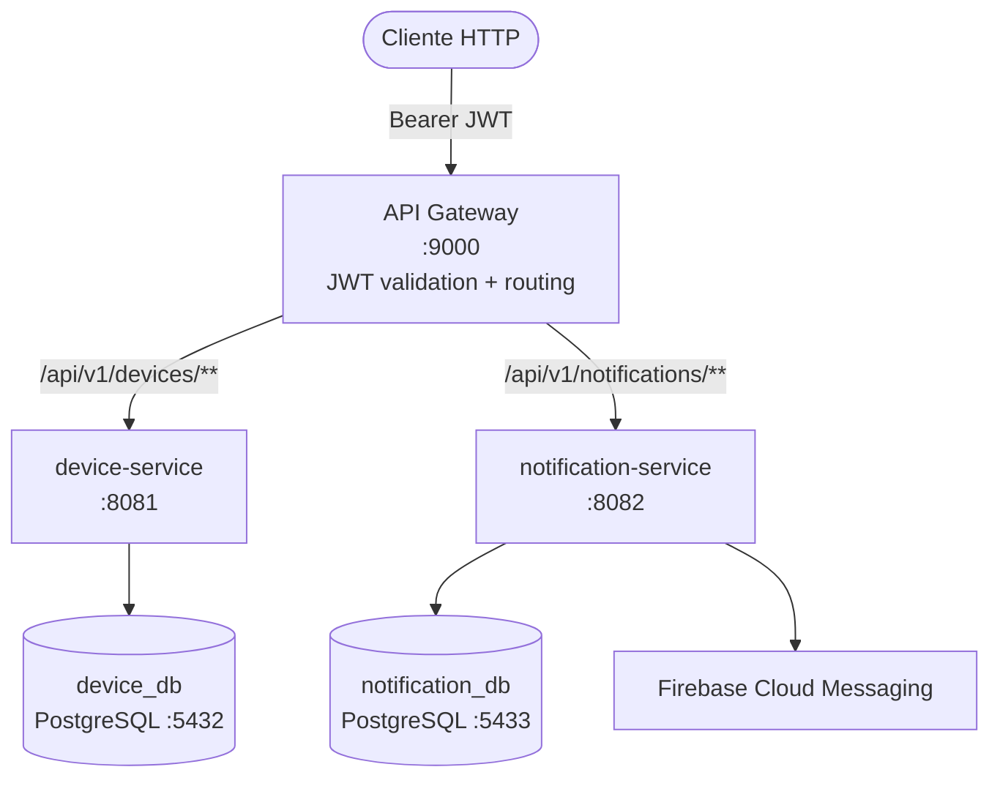
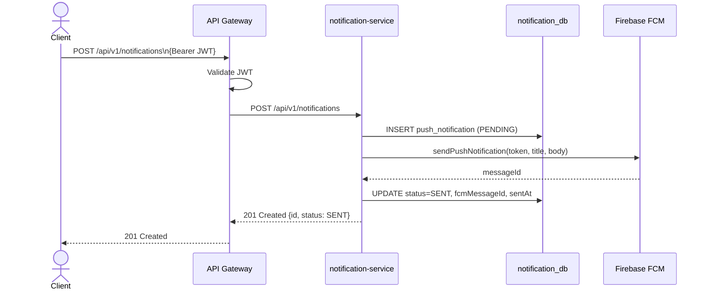
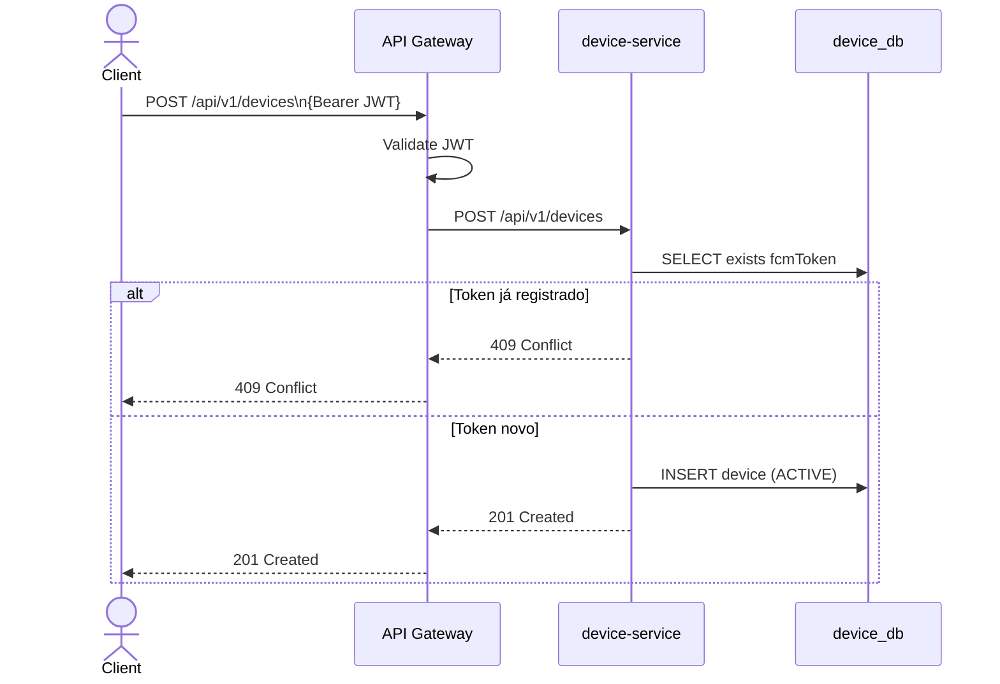
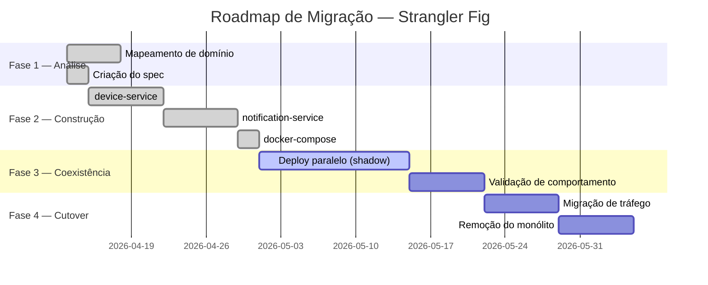

# Migração Arquitetural de Monólito para Microserviços: Um Estudo de Caso com Push Notification Manager

**Vitor Maverick**  
Instituto Federal do Maranhão (IFMA)  
Graduação em Análise e Desenvolvimento de Sistemas  
Trabalho de Conclusão de Curso — 2026

---

## Resumo

Este documento descreve formalmente o processo de migração arquitetural de uma aplicação monolítica responsável pelo gerenciamento de notificações push para uma arquitetura baseada em microserviços. A migração aplica os padrões Strangler Fig, Database per Service e Domain-Driven Design (DDD), com propagação de autenticação via JSON Web Tokens (JWT). O estudo apresenta a motivação técnica, as decisões arquiteturais, os diagramas de contexto e sequência, os riscos identificados e os resultados esperados, constituindo um registro acadêmico formal do processo de modernização realizado no âmbito do projeto Push Notification Manager.

**Palavras-chave:** microserviços, DDD, Strangler Fig, JWT, arquitetura hexagonal, Spring Boot.

---

## 1. Introdução

A evolução de sistemas de software ao longo do tempo frequentemente resulta em bases de código monolíticas que, embora funcionais, apresentam limitações crescentes em termos de escalabilidade, manutenibilidade e implantação independente de funcionalidades. O padrão arquitetural de microserviços surge como resposta a essas limitações, propondo a decomposição do sistema em unidades de implantação autônomas, cada uma responsável por um contexto delimitado (NEWMAN, 2019).

O presente estudo de caso documenta a extração de dois microserviços a partir do monólito Push Notification Manager: o **device-service**, responsável pelo registro e ciclo de vida de tokens FCM (Firebase Cloud Messaging), e o **notification-service**, responsável pelo despacho e rastreamento de notificações push. A extração segue o padrão Strangler Fig (FOWLER, 2004), que preconiza a coexistência gradual dos sistemas legado e novo durante o período de transição.

### 1.1 Objetivos

- Documentar formalmente as decisões arquiteturais tomadas durante a migração.
- Apresentar os padrões aplicados e sua justificativa técnica.
- Descrever os limites de contexto identificados por meio de DDD.
- Registrar os riscos e estratégias de mitigação adotadas.

### 1.2 Escopo

O escopo deste documento abrange exclusivamente os serviços extraídos do módulo de notificações push, não incluindo os demais módulos do sistema acadêmico de origem.

---

## 2. Contexto do Sistema Legado

O Push Notification Manager foi desenvolvido originalmente como uma aplicação Spring Boot monolítica com banco de dados relacional único. O sistema é responsável por:

1. Registrar dispositivos móveis e seus respectivos tokens FCM.
2. Disparar notificações push via Firebase Cloud Messaging (FCM).
3. Rastrear o estado de entrega de cada notificação.



**Figura 1 — Arquitetura do sistema monolítico original.**

Com o crescimento dos requisitos, o monólito apresentou os seguintes problemas:

- **Acoplamento de dados:** dispositivos e notificações compartilhavam o mesmo schema, impedindo escalabilidade independente.
- **Implantação única:** mudanças no módulo de dispositivos exigiam re-implantação do módulo de notificações, e vice-versa.
- **Dificuldade de teste:** a interdependência entre módulos tornava os testes de unidade e integração mais complexos.

---

## 3. Fundamentação Teórica

### 3.1 Domain-Driven Design (DDD)

Domain-Driven Design é uma abordagem de desenvolvimento de software proposta por Evans (2003) que coloca o modelo de domínio no centro do processo de desenvolvimento. No contexto de microserviços, DDD fornece os instrumentos conceituais para a decomposição do sistema:

- **Bounded Context (Contexto Delimitado):** unidade de separação lógica onde um modelo de domínio possui significado coerente e completo.
- **Ubiquitous Language (Linguagem Ubíqua):** vocabulário compartilhado entre desenvolvedores e especialistas de domínio dentro de um bounded context.
- **Aggregate:** cluster de objetos de domínio tratados como uma unidade coesa para fins de consistência.

Neste projeto, foram identificados dois bounded contexts distintos:

| Bounded Context       | Aggregate Root     | Responsabilidade                          |
| --------------------- | ------------------ | ----------------------------------------- |
| Device Management     | `Device`           | Registro e ciclo de vida de tokens FCM    |
| Notification Dispatch | `PushNotification` | Envio e rastreamento de notificações push |

### 3.2 Arquitetura Hexagonal (Ports and Adapters)

Proposta por Cockburn (2005), a arquitetura hexagonal organiza o código em três camadas:

1. **Domínio:** entidades, value objects e regras de negócio puras.
2. **Ports:** interfaces que definem contratos de entrada e saída.
3. **Adapters:** implementações concretas dos ports (REST, JPA, Firebase).

Essa organização garante que o núcleo de negócio não dependa de tecnologias externas, facilitando testes e substituição de implementações.



**Figura 2 — Arquitetura Hexagonal aplicada ao notification-service.**

### 3.3 Strangler Fig Pattern

O padrão Strangler Fig, descrito por Fowler (2004), é uma estratégia de migração incremental inspirada na figueira estranguladora, que cresce ao redor de uma árvore hospedeira até substituí-la. Aplicado a sistemas de software:

1. O novo serviço é construído em paralelo ao monólito.
2. O tráfego é gradualmente desviado para o novo serviço.
3. O código correspondente é removido do monólito após validação.

Essa abordagem minimiza o risco da migração ao evitar a reescrita completa do sistema ("big bang rewrite").

### 3.4 Database per Service

O padrão Database per Service (RICHARDSON, 2018) estabelece que cada microserviço deve possuir seu próprio banco de dados isolado, impedindo o compartilhamento de dados via schema. Benefícios:

- **Desacoplamento:** mudanças no schema de um serviço não afetam outros.
- **Escalabilidade:** cada banco pode ser dimensionado independentemente.
- **Tecnologia heterogênea:** cada serviço pode usar o banco mais adequado ao seu padrão de acesso.

No projeto, a separação foi realizada da seguinte forma:

| Serviço              | Banco                                | Schema principal    |
| -------------------- | ------------------------------------ | ------------------- |
| device-service       | `device_db` (PostgreSQL :5432)       | `device`            |
| notification-service | `notification_db` (PostgreSQL :5433) | `push_notification` |

### 3.5 JWT como Mecanismo de Propagação de Identidade

JSON Web Tokens (JONES et al., 2015) são utilizados para propagar a identidade do usuário autenticado entre os serviços sem necessidade de chamadas síncronas a um servidor de autenticação centralizado. Cada microserviço valida o token de forma independente utilizando a chave secreta compartilhada (`JWT_BASE64_SECRET`), mantendo a arquitetura stateless e eliminando o acoplamento temporal com o serviço de autenticação.

---

## 4. Análise do Domínio e Identificação de Bounded Contexts

### 4.1 Mapeamento de Contextos

A análise do código monolítico revelou dois contextos com responsabilidades distintas e baixo acoplamento lógico entre si:



**Figura 3 — Mapeamento de Bounded Contexts e relação de duplicação controlada de value objects.**

O valor `FcmToken` aparece em ambos os contextos com semântica ligeiramente diferente: em Device Management representa a identidade do dispositivo; em Notification Dispatch representa o destino da notificação. A decisão arquitetural foi duplicar o value object em cada serviço, evitando a criação de uma biblioteca compartilhada que geraria acoplamento de build.

### 4.2 Identificação da Fronteira de Extração

A fronteira natural de extração foi determinada pela ausência de chave estrangeira entre os dados de dispositivo e os dados de notificação no schema original. A coluna `recipient_token` na tabela `push_notification` armazena o valor do token FCM como string, sem referência à tabela `device`. Essa característica do design original tornou a extração limpa, sem necessidade de quebrar integridade referencial.

---

## 5. Arquitetura Alvo

### 5.1 Visão Geral



**Figura 4 — Arquitetura alvo após extração dos microserviços.**

### 5.2 Contratos de API

#### device-service

| Método | Endpoint                  | Descrição                      |
| ------ | ------------------------- | ------------------------------ |
| POST   | `/api/v1/devices`         | Registra token FCM             |
| GET    | `/api/v1/devices`         | Lista dispositivos registrados |
| GET    | `/api/v1/devices/{token}` | Consulta dispositivo por token |

#### notification-service

| Método | Endpoint                     | Descrição                       |
| ------ | ---------------------------- | ------------------------------- |
| POST   | `/api/v1/notifications`      | Envia notificação push          |
| GET    | `/api/v1/notifications`      | Lista histórico de notificações |
| GET    | `/api/v1/notifications/{id}` | Detalha notificação por ID      |
| POST   | `/api/v1/notifications/ack`  | Confirma entrega (webhook FCM)  |

### 5.3 Fluxo de Envio de Notificação



**Figura 5 — Diagrama de sequência do fluxo de envio de notificação push.**

### 5.4 Fluxo de Registro de Dispositivo



**Figura 6 — Diagrama de sequência do fluxo de registro de dispositivo.**

---

## 6. Implementação

### 6.1 Estrutura de Pacotes

Ambos os serviços seguem a mesma estrutura de pacotes derivada da arquitetura hexagonal:

```
br.edu.acad.ifma.{service}/
├── domain/          # Entidades, value objects, exceções de domínio
├── port/            # Interfaces de entrada e saída (ports)
├── usecase/         # Casos de uso da aplicação
├── adapter/
│   ├── persistence/ # Adaptadores JPA (saída)
│   ├── rest/        # Controladores REST e DTOs (entrada)
│   └── fcm/         # Adaptador Firebase (saída, apenas notification-service)
└── config/          # Configurações de segurança e beans
```

### 6.2 Value Objects como Records Java

A escolha de `record` do Java 16+ para representar value objects garante imutabilidade e igualdade estrutural nativamente, sem boilerplate:

```java
public record FcmToken(String value) {
  public FcmToken {
    if (value == null || value.isBlank()) throw new IllegalArgumentException("FCM token must not be blank");
  }
}
```

A validação é realizada no construtor canônico do record, garantindo que objetos inválidos jamais sejam instanciados — princípio conhecido como "Make Illegal States Unrepresentable".

### 6.3 Ports como Contratos Puros

Os ports são definidos como interfaces Java sem dependências de frameworks:

```java
public interface PushSenderPort {
  String sendPushNotification(FcmToken token, NotificationTitle title, NotificationBody body);
  String sendPushNotification(FcmToken token, NotificationTitle title, NotificationBody body, Map<String, String> data);
}
```

Essa abstração permite substituir o Firebase por qualquer outro provedor de push (APNS, OneSignal) sem alterar os casos de uso.

### 6.4 Segurança com Spring OAuth2 Resource Server

Cada microserviço opera como um OAuth2 Resource Server independente, validando o JWT localmente:

```yaml
spring:
  security:
    oauth2:
      resourceserver:
        jwt:
          base64-secret: ${JWT_BASE64_SECRET}
```

A configuração stateless elimina a necessidade de sessões HTTP e de consultas a um servidor de autenticação central em cada requisição.

### 6.5 Tratamento de Erros com ProblemDetail

Os controladores REST utilizam `ProblemDetail` (RFC 7807), padronizando as respostas de erro:

```json
{
  "type": "urn:problem:not-found",
  "status": 404,
  "detail": "Notification not found: 42",
  "timestamp": "2026-05-26T10:30:00Z"
}
```

---

## 7. Estratégia de Migração (Strangler Fig)

### 7.1 Fases da Migração



**Figura 7 — Roadmap de migração utilizando o padrão Strangler Fig.**

### 7.2 Fase de Coexistência (Shadow Mode)

Durante a fase de coexistência, ambos os sistemas (monólito e microserviços) recebem as mesmas requisições em paralelo. As respostas do monólito são servidas ao cliente, enquanto as respostas dos microserviços são comparadas silenciosamente para validação de comportamento. Divergências são registradas em logs estruturados para análise.

### 7.3 Critérios de Cutover

A migração de tráfego para os microserviços ocorre após:

1. Taxa de erro < 0.1% por 72h consecutivas.
2. Latência P99 dos microserviços ≤ latência P99 do monólito.
3. Paridade de respostas > 99.9% na fase shadow.
4. Testes de carga aprovados para o dobro do tráfego atual.

---

## 8. Análise de Riscos

| Risco                                                                     | Probabilidade | Impacto | Mitigação                                                                    |
| ------------------------------------------------------------------------- | ------------- | ------- | ---------------------------------------------------------------------------- |
| Duplicação de eventos entre monólito e microserviços durante coexistência | Alta          | Alto    | Idempotência nas operações; uso de `fcmMessageId` como chave de deduplicação |
| Falha no Firebase durante migração                                        | Média         | Alto    | Retry com backoff exponencial; status `FAILED` persistido com razão          |
| Inconsistência de schema entre `device_db` e dados do monólito            | Média         | Médio   | Script de migração de dados + validação de integridade pré-cutover           |
| Latência adicional por validação JWT duplicada                            | Baixa         | Baixo   | Cache de validação de chave pública; JWT stateless elimina I/O de sessão     |
| Regressão em funcionalidades não testadas                                 | Média         | Médio   | Testes de contrato (Consumer-Driven Contract Testing) pré-cutover            |

---

## 9. Resultados e Conclusão

A extração dos microserviços device-service e notification-service do monólito Push Notification Manager demonstra a viabilidade da aplicação do padrão Strangler Fig em sistemas acadêmicos de porte médio. Os principais benefícios arquiteturais alcançados são:

1. **Implantação independente:** alterações no ciclo de vida de dispositivos não exigem re-implantação do serviço de notificações, e vice-versa.
2. **Escalabilidade granular:** o notification-service, que integra com o Firebase e possui maior carga de processamento, pode ser escalado horizontalmente de forma independente.
3. **Isolamento de falhas:** uma falha no Firebase afeta apenas o notification-service, sem impactar o registro de dispositivos.
4. **Testabilidade aprimorada:** a arquitetura hexagonal permite testar os casos de uso em isolamento, sem dependências de infraestrutura.
5. **Clareza de domínio:** os bounded contexts explicitam as responsabilidades de cada serviço, reduzindo o risco de acoplamento acidental.

A duplicação controlada do value object `FcmToken` em ambos os serviços, embora contraintuitiva à primeira vista, constitui uma decisão deliberada que preserva a autonomia de cada bounded context, evitando o surgimento de bibliotecas compartilhadas que degradariam a independência de implantação ao longo do tempo.

A migração utilizando o padrão Strangler Fig permite que o sistema legado continue operacional durante todo o processo de transição, eliminando o risco catastrófico de uma reescrita completa. A adoção do padrão Database per Service garante que a separação de domínios seja respeitada não apenas no código, mas também nos dados, constituindo a base para a evolução independente de cada serviço no longo prazo.

---

## Referências

COCKBURN, A. **Hexagonal Architecture**. 2005. Disponível em: https://alistair.cockburn.us/hexagonal-architecture/

EVANS, E. **Domain-Driven Design: Tackling Complexity in the Heart of Software**. Addison-Wesley, 2003.

FOWLER, M. **Strangler Fig Application**. 2004. Disponível em: https://martinfowler.com/bliki/StranglerFigApplication.html

JONES, M.; BRADLEY, J.; SAKIMURA, N. **RFC 7519: JSON Web Token (JWT)**. IETF, 2015.

NEWMAN, S. **Monolith to Microservices: Evolutionary Patterns to Transform Your Monolith**. O'Reilly Media, 2019.

RICHARDSON, C. **Microservices Patterns: With Examples in Java**. Manning Publications, 2018.

---

_Documento gerado em 26 de maio de 2026 — Projeto Push Notification Manager, TCC IFMA._
