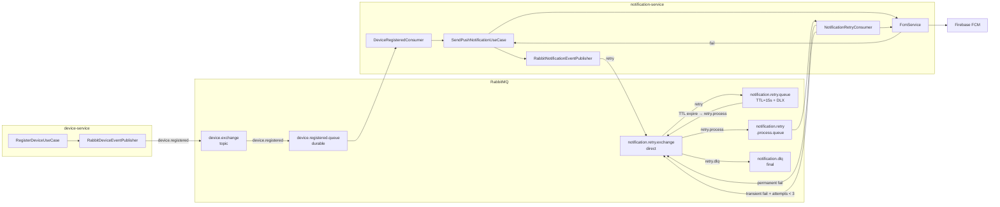
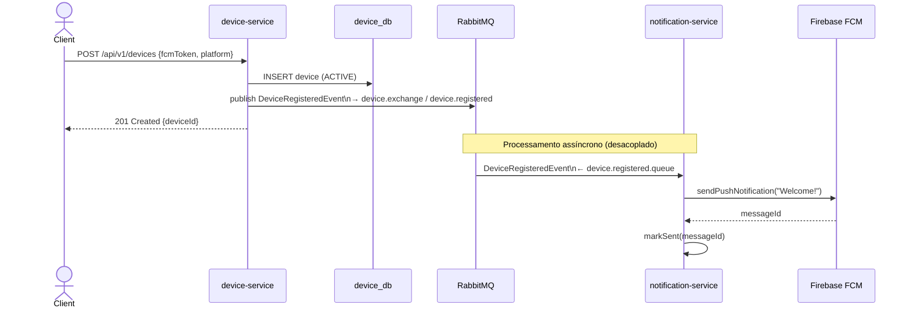
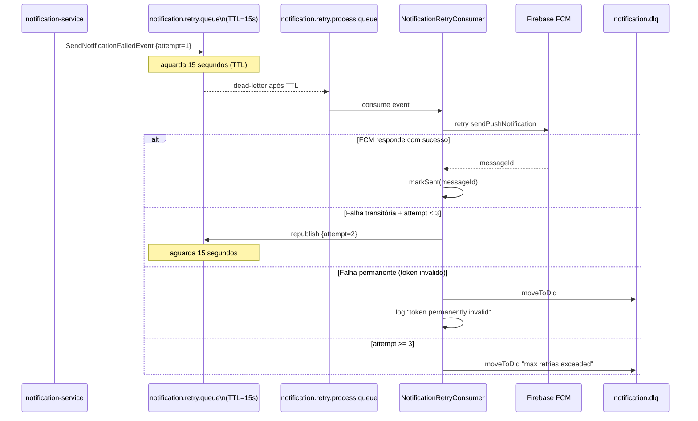

# Documentação da Migração para Arquitetura Orientada a Eventos no Push Notification Manager

**Vitor Maverick**  
Instituto Federal do Maranhão (IFMA)  
Graduação em Análise e Desenvolvimento de Sistemas  
Trabalho de Conclusão de Curso — 2026

---

## Resumo

Este documento descreve formalmente a evolução arquitetural do sistema Push Notification Manager, da comunicação síncrona REST para uma arquitetura orientada a eventos (Event-Driven Architecture — EDA) utilizando RabbitMQ como message broker. A migração introduz dois fluxos assíncronos: o envio automático de notificação de boas-vindas ao registrar um novo dispositivo, e um mecanismo de retry com backoff por fila de atraso (dead-letter queue com TTL) para reenvios de notificações que falham temporariamente junto ao Firebase Cloud Messaging (FCM). O documento cobre a motivação técnica, a modelagem dos eventos, as decisões de design, a implementação e os resultados esperados.

**Palavras-chave:** Event-Driven Architecture, RabbitMQ, Dead-Letter Queue, retry pattern, Spring AMQP, microserviços.

---

## 1. Introdução

### 1.1 Limitações da Arquitetura Síncrona

A versão anterior do Push Notification Manager operava com comunicação exclusivamente síncrona: o `device-service` registrava o dispositivo e retornava ao cliente; o `notification-service` tentava enviar a notificação via FCM e, em caso de falha, gravava o status `FAILED` sem qualquer mecanismo de retentativa automática.

Essa abordagem apresenta três limitações estruturais:

1. **Ausência de reação a eventos de domínio:** o registro de um novo dispositivo era um evento isolado — nenhum outro componente do sistema reagia a ele. A notificação de boas-vindas precisaria ser disparada pelo cliente, acoplando a lógica de negócio ao frontend.

2. **Fragilidade ante falhas transitórias do FCM:** o Firebase Cloud Messaging é um serviço externo sujeito a instabilidades de rede, cotas temporárias e indisponibilidades momentâneas. Sem retry, toda falha transitória resultava em perda definitiva da notificação.

3. **Acoplamento temporal:** para que uma operação dependente ocorresse, o serviço dependente precisava estar disponível no mesmo instante. Uma queda momentânea do `notification-service` durante o registro de um dispositivo impediria a notificação de boas-vindas sem possibilidade de recuperação.

### 1.2 Motivação para EDA

A Arquitetura Orientada a Eventos resolve esses problemas ao inverter o modelo de comunicação: em vez de o produtor chamar o consumidor diretamente (push síncrono), o produtor publica um evento em um broker e o consumidor reage quando disponível (push assíncrono desacoplado).

Os benefícios diretos para o sistema são:

- **Resiliência:** o broker persiste as mensagens; o consumidor pode estar temporariamente indisponível sem perda de evento.
- **Desacoplamento temporal e lógico:** `device-service` não conhece o `notification-service`; apenas publica o evento.
- **Retry automático:** mensagens que falham são reintroduzidas no fluxo após um período de espera, sem intervenção manual.
- **Escalabilidade independente:** consumidores podem ser escalados horizontalmente sem alteração nos produtores.

---

## 2. Modelagem dos Eventos e Fluxos Assíncronos

### 2.1 Eventos de Domínio

#### 2.1.1 `DeviceRegisteredEvent`

Publicado pelo `device-service` imediatamente após persistir um novo dispositivo com sucesso. Representa o fato de domínio "um dispositivo foi registrado".

| Campo          | Tipo      | Descrição                               |
| -------------- | --------- | --------------------------------------- |
| `deviceId`     | `Long`    | Identificador do dispositivo persistido |
| `fcmToken`     | `String`  | Token FCM do dispositivo                |
| `platform`     | `String`  | Plataforma (ANDROID, IOS, WEB)          |
| `registeredAt` | `Instant` | Timestamp do registro                   |

**Consumidor:** `DeviceRegisteredConsumer` no `notification-service`, que dispara a notificação de boas-vindas de forma assíncrona.

#### 2.1.2 `SendNotificationFailedEvent`

Publicado pelo `notification-service` quando o FCM retorna falha durante o envio. Representa o fato de domínio "uma tentativa de envio falhou".

| Campo            | Tipo                 | Descrição                  |
| ---------------- | -------------------- | -------------------------- |
| `notificationId` | `Long`               | ID da notificação no banco |
| `recipientToken` | `String`             | Token FCM de destino       |
| `title`          | `String`             | Título da notificação      |
| `body`           | `String`             | Corpo da notificação       |
| `data`           | `Map<String,String>` | Dados extras opcionais     |
| `failureReason`  | `String`             | Mensagem de erro do FCM    |
| `attemptCount`   | `int`                | Número da tentativa atual  |
| `failedAt`       | `Instant`            | Timestamp da falha         |

**Consumidor:** `NotificationRetryConsumer`, que tenta reenvio com limite de 3 tentativas e encaminha para DLQ em caso de esgotamento.

### 2.2 Topologia de Mensageria



**Figura 1 — Topologia completa de mensageria: produtores, exchanges, filas e consumidores.**

### 2.3 Fluxo de Registro de Dispositivo com Notificação de Boas-Vindas



**Figura 2 — Registro de dispositivo com notificação de boas-vindas assíncrona.**

### 2.4 Fluxo de Retry com Dead-Letter Queue



**Figura 3 — Fluxo de retry com dead-letter queue e TTL.**

---

## 3. Decisões de Design

### 3.1 Escolha do RabbitMQ

O RabbitMQ foi escolhido por três razões principais:

1. **Suporte nativo a DLX/TTL:** o mecanismo de dead-letter exchange com time-to-live é nativo no RabbitMQ, permitindo implementar o delay de retry sem código de sleep ou schedulers externos.
2. **Spring AMQP maduro:** o `spring-boot-starter-amqp` fornece integração completa com Spring IoC, conversão automática de JSON via `Jackson2JsonMessageConverter` e declaração de topologia por beans.
3. **Adequação ao contexto acadêmico:** o RabbitMQ é amplamente documentado e ensinado em cursos de sistemas distribuídos, facilitando a compreensão do projeto pela banca avaliadora.

**Apache Kafka** seria mais adequado em cenários com volume muito alto de eventos ou necessidade de replay de histórico (event sourcing). Para o volume do Push Notification Manager, o RabbitMQ é suficiente e mais simples de operar.

### 3.2 Estratégia de Retry

**TTL + DLX (Dead-Letter Exchange)** foi escolhido sobre as alternativas:

- **Sleep no listener:** bloquearia a thread do consumidor, reduzindo o throughput.
- **Scheduler externo:** adicionaria dependência de banco ou estado compartilhado.
- **Plugin `rabbitmq-delayed-message-exchange`:** requer instalação de plugin no broker; menos portável.

A abordagem adotada:

1. Mensagem entra na `notification.retry.queue` com `x-message-ttl=15000ms`.
2. Após 15s sem consumo (sem consumidor na fila de delay), a mensagem expira e o RabbitMQ a encaminha via `x-dead-letter-exchange` para `notification.retry.process.queue`.
3. `NotificationRetryConsumer` processa; se falha novamente, republica na fila de delay com `attemptCount` incrementado.
4. Após 3 tentativas, a mensagem vai para `notification.dlq`.

**Backoff fixo** (15s fixo entre tentativas) foi usado por simplicidade. Em produção, backoff exponencial seria implementado usando TTLs distintas por nível de retry (3 filas: 15s, 60s, 300s).

### 3.3 Consistência Eventual

Com EDA, o sistema adota **consistência eventual**: ao registrar um dispositivo, o cliente recebe 201 imediatamente, mas a notificação de boas-vindas só chegará alguns milissegundos depois (quando o broker entregar ao consumidor). Isso é aceitável — o usuário não precisa esperar a notificação para confirmar o registro.

Para o retry de FCM, a consistência eventual é ainda mais evidente: a notificação pode ser entregue de 15s a 45s após a falha original. O sistema mantém o estado `FAILED` no banco até que o retry tenha sucesso.

### 3.4 Duplicação Controlada do `DeviceRegisteredEvent`

O evento `DeviceRegisteredEvent` é definido em ambos os serviços como classes Java idênticas, sem biblioteca compartilhada. Essa decisão foi tomada por:

1. **Evitar acoplamento de build:** uma lib compartilhada exigiria versionamento coordenado entre os dois serviços — exatamente o tipo de acoplamento que a arquitetura de microserviços busca eliminar.
2. **Idempotência do contrato JSON:** o broker transmite JSON; desde que os campos sejam iguais, a desserialização funciona independentemente da classe Java usada em cada lado.
3. **Evolução independente:** se o `notification-service` precisar de um campo extra do evento, pode adicioná-lo localmente sem alterar o `device-service`.

### 3.5 Comunicações que Permanecem Síncronas

As comunicações iniciadas pelo frontend (cliente → REST → serviço) permanecem síncronas. O usuário espera uma resposta imediata ao registrar um dispositivo ou consultar o histórico de notificações. A assincronicidade é introduzida apenas nas comunicações **inter-serviços** e no mecanismo de retry — onde não há usuário aguardando.

### 3.6 Idempotência

O `DeviceRegisteredConsumer` pode, em cenários de falha do broker, receber o mesmo evento mais de uma vez (at-least-once delivery). Para mitigar:

- A `SendPushNotificationUseCase` já cria uma nova notificação a cada chamada — uma notificação de boas-vindas duplicada é indesejável mas não catastrófica.
- Em produção, recomenda-se armazenar o `deviceId` em uma tabela de idempotência com TTL, descartando eventos já processados.

---

## 4. Implementação

### 4.1 device-service

#### RabbitMQConfig

```java
@Configuration
public class RabbitMQConfig {
    public static final String DEVICE_EXCHANGE = "device.exchange";
    public static final String DEVICE_REGISTERED_QUEUE = "device.registered.queue";
    public static final String DEVICE_REGISTERED_ROUTING_KEY = "device.registered";

    @Bean TopicExchange deviceExchange() {
        return new TopicExchange(DEVICE_EXCHANGE, true, false);
    }
    @Bean Queue deviceRegisteredQueue() {
        return QueueBuilder.durable(DEVICE_REGISTERED_QUEUE).build();
    }
    @Bean Binding deviceRegisteredBinding(...) {
        return BindingBuilder.bind(deviceRegisteredQueue).to(deviceExchange).with(DEVICE_REGISTERED_ROUTING_KEY);
    }
    @Bean MessageConverter jsonMessageConverter() {
        return new Jackson2JsonMessageConverter();
    }
}
```

#### RegisterDeviceUseCase (modificado)

```java
public Device execute(RegisterDeviceCommand command) {
  // ... validação + construção do Device
  Device saved = deviceRepository.save(device);
  eventPublisher.publishDeviceRegistered(saved); // novo
  return saved;
}
```

A publicação ocorre **após** o `save` transacional, garantindo que o evento só seja publicado se a persistência tiver sucesso. Se o broker estiver indisponível no momento da publicação, a exceção sobe para o controller, que retorna 500 — a consistência com a operação de escrita é mantida pelo mecanismo de transação.

### 4.2 notification-service

#### Topologia de retry declarada via beans

```java
@Bean
public Queue notificationRetryQueue() {
  Map<String, Object> args = new HashMap<>();
  args.put("x-message-ttl", 15_000); // 15s de delay
  args.put("x-dead-letter-exchange", NOTIFICATION_RETRY_EXCHANGE);
  args.put("x-dead-letter-routing-key", ROUTING_RETRY_PROCESS);
  return QueueBuilder.durable(NOTIFICATION_RETRY_QUEUE).withArguments(args).build();
}
```

O Spring AMQP declara automaticamente a topologia no RabbitMQ ao inicializar o contexto — sem necessidade de configuração manual no console do broker.

#### SendPushNotificationUseCase (modificado)

```java
} catch (PushSendingException e) {
    saved.markFailed(e.getMessage());
    log.error("Notification {} failed on attempt {}: {}", saved.getId(), attemptNumber, e.getMessage());
    eventPublisher.publishSendNotificationFailed(new SendNotificationFailedEvent(
            saved.getId(), command.recipientToken(), command.title(), command.body(),
            command.data(), e.getMessage(), attemptNumber
    ));
}
```

A exceção **não é relançada** — o use case persiste o status `FAILED` e publica o evento de retry. O controller recebe a notificação no estado `FAILED` e retorna 201 ao cliente; o retry ocorre de forma completamente assíncrona.

#### NotificationRetryConsumer — lógica de decisão

```java
@RabbitListener(queues = NOTIFICATION_RETRY_PROCESS_QUEUE)
public void onRetry(SendNotificationFailedEvent event) {
    if (event.getAttemptCount() > MAX_RETRY_ATTEMPTS) {
        moveToDlq(event, "Max retry attempts exceeded");
        return;
    }
    try {
        String messageId = pushSender.sendPushNotification(...);
        repository.findById(event.getNotificationId())
                  .ifPresent(n -> { n.markSent(messageId); repository.save(n); });
    } catch (PushSendingException e) {
        if (isPermanentFailure(e.getMessage())) {
            moveToDlq(event, "Permanent failure: " + e.getMessage());
            deactivateDeviceIfPossible(event.getRecipientToken());
        } else {
            scheduleNextRetry(event, e.getMessage()); // republica com attempt+1
        }
    }
}
```

**Falhas permanentes** (token inválido, dispositivo desregistrado) são identificadas pelas strings `invalid-argument`, `registration-token-not-registered` e `unregistered` nas mensagens de erro do Firebase. Nesses casos, o token jamais ficará válido — retentar seria desperdiçar recursos.

### 4.3 Estrutura de Arquivos Adicionados

```
services/device-service/src/main/java/.../device/
├── adapter/messaging/
│   ├── DeviceRegisteredEvent.java        ← Event POJO (produtor)
│   └── RabbitDeviceEventPublisher.java   ← Adapter do port de saída
├── config/
│   └── RabbitMQConfig.java               ← Declaração de exchange e fila
└── port/
    └── DeviceEventPublisherPort.java     ← Port de saída (contrato)

services/notification-service/src/main/java/.../notification/
├── adapter/messaging/
│   ├── DeviceRegisteredEvent.java              ← Event POJO (consumidor, duplicata controlada)
│   ├── SendNotificationFailedEvent.java        ← Event POJO (produzido em falha)
│   ├── RabbitNotificationEventPublisher.java   ← Adapter do port de saída
│   ├── DeviceRegisteredConsumer.java           ← Listener: dispara welcome notification
│   └── NotificationRetryConsumer.java         ← Listener: retry + DLQ
├── config/
│   └── RabbitMQConfig.java                     ← Topologia completa (exchanges + filas + bindings)
└── port/
    └── NotificationEventPublisherPort.java     ← Port de saída (contrato)
```

---

## 5. Resultados e Benefícios

### 5.1 Comparação com a Versão Anterior

| Aspecto                                 | Síncrono (anterior)               | Orientado a Eventos (atual)                |
| --------------------------------------- | --------------------------------- | ------------------------------------------ |
| Boas-vindas ao registrar                | Não implementado                  | Automático via `DeviceRegisteredConsumer`  |
| Retry em falha FCM                      | Sem retry — notificação perdida   | 3 tentativas com delay de 15s entre cada   |
| Acoplamento device/notification         | Sem chamada REST direta           | Completamente desacoplados via broker      |
| Disponibilidade de notification-service | Necessária no momento do registro | Desnecessária — evento persiste no broker  |
| Tolerância a falhas transitórias FCM    | Nula                              | Alta — retry automático com DLQ            |
| Visibilidade de falhas                  | Log apenas                        | DLQ navegável no console RabbitMQ (:15672) |

### 5.2 Ganhos de Resiliência

Com o retry de 3 tentativas e delay de 15s, o sistema tolera interrupções do FCM de até 45 segundos sem perda de notificação. Falhas permanentes (tokens inválidos) são isoladas na DLQ e não consomem tentativas de tokens válidos.

### 5.3 Observabilidade

O console de gerenciamento do RabbitMQ (`localhost:15672`) fornece visibilidade em tempo real:

- Mensagens na `notification.retry.queue` indicam tentativas em andamento.
- Mensagens na `notification.dlq` requerem atenção — indicam falhas persistentes.
- Taxa de publicação vs. consumo na `device.registered.queue` indica se o consumidor está processando em ritmo adequado.

---

## 6. Riscos e Limitações

| Risco                                                         | Probabilidade | Impacto | Mitigação                                                                 |
| ------------------------------------------------------------- | ------------- | ------- | ------------------------------------------------------------------------- |
| Mensagem duplicada (at-least-once delivery)                   | Baixa         | Médio   | Tabela de idempotência com `notificationId` + TTL                         |
| RabbitMQ indisponível no momento do `publishDeviceRegistered` | Baixa         | Alto    | Publisher confirms + outbox pattern para cenário crítico                  |
| Delay de 15s insuficiente para recuperação do FCM             | Baixa         | Baixo   | Configurar TTL via env var; aumentar para backoff exponencial             |
| DLQ crescendo sem monitoramento                               | Média         | Médio   | Alertas no Grafana ou CloudWatch sobre `queue.messages` da DLQ            |
| Ordem de processamento não garantida                          | Baixa         | Baixo   | RabbitMQ não é Kafka; para garantir ordem usar `x-single-active-consumer` |
| Maior complexidade de debugging                               | Alta          | Baixo   | Correlação por `notificationId` nos logs estruturados de cada serviço     |

### 6.1 Complexidade Adicional de Depuração

Em sistemas síncronos, o stack trace de uma exceção contém toda a cadeia de chamadas. Em sistemas orientados a eventos, um evento publicado por um serviço e consumido por outro em um thread distinto resulta em stack traces desconexos. A correlação é feita pelo `notificationId` nos logs — recomenda-se MDC (Mapped Diagnostic Context) do SLF4J para propagação automática.

### 6.2 Consistência Eventual vs. Transacional

A publicação do evento e a persistência do dispositivo ocorrem em contextos separados (transação JPA + `RabbitTemplate`). Se o commit JPA tiver sucesso e a publicação falhar (broker caído), o dispositivo estará registrado mas o evento nunca será publicado — notificação de boas-vindas perdida.

Para cenários de alta criticidade, o padrão **Outbox** resolve isso: o evento é gravado na mesma transação do banco em uma tabela `outbox`, e um relay process o publica no broker separadamente, com garantia transacional.

---

## 7. Conclusão e Próximos Passos

A migração do Push Notification Manager para arquitetura orientada a eventos representa um avanço qualitativo significativo em resiliência e desacoplamento, sem comprometer a simplicidade operacional do sistema. Os dois fluxos assíncronos introduzidos — boas-vindas e retry de FCM — cobrem os casos de uso de maior impacto prático para um sistema de notificações push.

### 7.1 Próximos Passos

1. **Evento `DeviceTokenInvalidated`:** quando o `NotificationRetryConsumer` identifica um token permanentemente inválido, publicar um evento nomeado para que o `device-service` marque o dispositivo como `INACTIVE` de forma assíncrona — completando o ciclo de feedback entre os serviços.

2. **Backoff exponencial:** substituir o TTL fixo de 15s por três filas de delay com TTLs de 15s, 60s e 300s, reduzindo a carga no FCM durante períodos de cota excedida.

3. **Outbox Pattern:** garantir consistência transacional entre persistência e publicação de eventos, eliminando o risco de eventos perdidos em falha do broker.

4. **Consumer-Driven Contract Testing (CDCT):** usar Pact para verificar que o contrato JSON do `DeviceRegisteredEvent` produzido pelo `device-service` é compatível com o esperado pelo `notification-service`, prevenindo regressões silenciosas na evolução do payload.

5. **Saga para fluxos longos:** se o sistema evoluir para incluir operações de múltiplos passos (ex: provisionar notificação + validar destinatário + despachar + confirmar leitura), o padrão Saga com coreografia via eventos fornecerá coordenação distribuída sem acoplamento síncrono.

---

## Referências

FOWLER, M. **Event-Driven Architecture**. 2017. Disponível em: https://martinfowler.com/articles/201701-event-driven.html

FOWLER, M. **Transactional Outbox Pattern**. 2023. Disponível em: https://microservices.io/patterns/data/transactional-outbox.html

NEWMAN, S. **Monolith to Microservices: Evolutionary Patterns to Transform Your Monolith**. O'Reilly Media, 2019.

RICHARDSON, C. **Microservices Patterns: With Examples in Java**. Manning Publications, 2018.

PIVOTAL SOFTWARE. **Spring AMQP Reference Documentation**. 2024. Disponível em: https://docs.spring.io/spring-amqp/docs/current/reference/html/

RABBITMQ. **Dead Letter Exchanges**. 2024. Disponível em: https://www.rabbitmq.com/dlx.html

RABBITMQ. **Time-To-Live and Expiration**. 2024. Disponível em: https://www.rabbitmq.com/ttl.html

---

_Documento gerado em 26 de maio de 2026 — Projeto Push Notification Manager, TCC IFMA._
