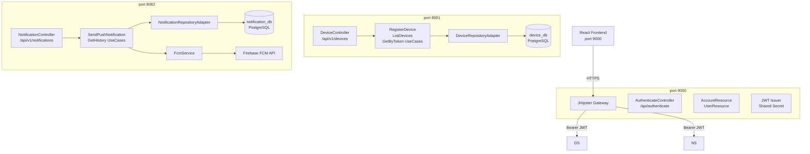

# Microservices Extraction Spec Plan

## push-notification-manager → device-service + notification-service

---

## 1. Visão Geral da Arquitetura Alvo



**Portas padrão:**
| Serviço | Porta |
|---|---|
| Gateway (monolito residual) | 9000 |
| device-service | 8081 |
| notification-service | 8082 |

---

## 2. Contratos de API REST por Serviço

### device-service — base URL: `http://localhost:8081`

| Método | Path                      | Auth | Request Body                                              | Response                     |
| ------ | ------------------------- | ---- | --------------------------------------------------------- | ---------------------------- |
| `POST` | `/api/v1/devices`         | JWT  | `{"fcmToken":"...", "platform":"WEB", "userAgent":"..."}` | `201` `DeviceResponse`       |
| `GET`  | `/api/v1/devices`         | JWT  | —                                                         | `200` `Page<DeviceResponse>` |
| `GET`  | `/api/v1/devices/{token}` | JWT  | —                                                         | `200` `DeviceResponse`       |

**DeviceResponse:**

```json
{
  "id": 1,
  "fcmToken": "eD3S8Xpr...",
  "platform": "WEB",
  "userAgent": "Mozilla/5.0...",
  "status": "ACTIVE",
  "registeredAt": "2026-05-19T17:28:55Z",
  "lastUsedAt": null
}
```

**Erro 409 — token duplicado:**

```json
{ "status": 409, "error": "DUPLICATE_TOKEN", "message": "Token already registered" }
```

---

### notification-service — base URL: `http://localhost:8082`

| Método | Path                                     | Auth | Request Body                                         | Response                                  |
| ------ | ---------------------------------------- | ---- | ---------------------------------------------------- | ----------------------------------------- |
| `POST` | `/api/v1/notifications`                  | JWT  | `{"deviceToken":"...", "title":"...", "body":"..."}` | `202` `NotificationResponse`              |
| `GET`  | `/api/v1/notifications`                  | JWT  | `?status=SENT&deviceToken=...&fromDate=...`          | `200` `Page<NotificationSummaryResponse>` |
| `GET`  | `/api/v1/notifications/{id}`             | JWT  | —                                                    | `200` `NotificationDetailResponse`        |
| `POST` | `/api/v1/notifications/internal/fcm/ack` | NONE | `{"notificationId":1,"messageId":"..."}`             | `200`                                     |

**NotificationResponse:**

```json
{
  "id": 3,
  "title": "Titulo teste 11",
  "status": "SENT",
  "fcmMessageId": "projects/xxx/messages/yyy",
  "createdAt": "2026-05-26T00:54:34Z"
}
```

---

## 3. Estratégia de Banco de Dados

**Decisão: um banco por serviço (Database-per-Service pattern)**

| Serviço              | Database               | Schema   | Tabelas                                           |
| -------------------- | ---------------------- | -------- | ------------------------------------------------- |
| device-service       | `device_db`            | `public` | `device`                                          |
| notification-service | `notification_db`      | `public` | `notification`                                    |
| Gateway              | `push_notification_db` | `public` | `jhi_user`, `jhi_authority`, `jhi_user_authority` |

**Justificativa:** `notification.recipient_token` já é uma `String` no código atual — sem FK para `device`. A integridade referencial é garantida pelo domínio (token inválido → FCM retorna erro → `FAILED`).

**DDL device_db:**

```sql
CREATE TABLE device (
    id          BIGSERIAL PRIMARY KEY,
    fcm_token   VARCHAR(512) NOT NULL UNIQUE,
    device_name VARCHAR(256),
    type        VARCHAR(32),
    status      VARCHAR(32)  NOT NULL DEFAULT 'ACTIVE',
    registered_at TIMESTAMPTZ NOT NULL DEFAULT NOW(),
    last_used_at  TIMESTAMPTZ
);
```

**DDL notification_db:**

```sql
CREATE TABLE notification (
    id              BIGSERIAL PRIMARY KEY,
    subject         VARCHAR(256),
    body            VARCHAR(2000),
    recipient_token VARCHAR(512) NOT NULL,
    fcm_message_id  VARCHAR(512),
    status          VARCHAR(32)  NOT NULL DEFAULT 'PENDING',
    sent_at         TIMESTAMPTZ,
    delivered_at    TIMESTAMPTZ,
    created_at      TIMESTAMPTZ NOT NULL DEFAULT NOW()
);

CREATE SEQUENCE notification_id_seq START 1 INCREMENT 1;
```

---

## 4. Mecanismo de Comunicação

**Decisão: REST síncrono na fase inicial**

- Frontend chama o Gateway (porta 9000) para autenticação.
- Frontend chama `device-service` e `notification-service` diretamente (com o JWT emitido pelo gateway).
- Não há comunicação direta entre `device-service` e `notification-service`.
- O `FcmAckRequest` é enviado pelo Service Worker diretamente ao `notification-service`.

**Evolução futura (fora do escopo desta branch):**

- Quando uma notificação for entregue (`DELIVERED`), emitir evento `NotificationDeliveredEvent` via RabbitMQ para que `device-service` atualize `last_used_at`.

```
Payload do evento futuro:
{
  "eventType": "NOTIFICATION_DELIVERED",
  "notificationId": 3,
  "deviceToken": "eD3S8Xpr...",
  "deliveredAt": "2026-05-26T01:00:00Z"
}
Topic: notification.events
Exchange: push.notifications (fanout)
```

---

## 5. Passo a Passo da Extração

1. **[FEITO]** Criar branch `refactor/microservice-extraction` a partir de `main`.
2. **[FEITO]** Criar branch `feature/microservice-initial-structure`.
3. **[ESTE PR]** Criar `services/device-service/` com Spring Boot completo.
4. **[ESTE PR]** Criar `services/notification-service/` com Spring Boot completo.
5. **[ESTE PR]** Criar `docker-compose.yml` para orquestração local.
6. Remover `DeviceController` e `NotificationController` do monolito.
7. Adicionar `RestTemplate`/`WebClient` no monolito para redirecionar chamadas.
8. Configurar CORS no gateway para aceitar chamadas do frontend aos microservices.
9. Atualizar o frontend React para chamar portas 8081/8082 diretamente (ou via proxy).
10. Adicionar testes de integração com Testcontainers nos dois microservices.
11. Abrir PR para `refactor/microservice-extraction`, fazer review, merge.

---

## 6. Dependências Compartilhadas

**Value objects duplicados de forma controlada** (não há lib compartilhada — evita acoplamento de build):

| Classe                 | device-service | notification-service |
| ---------------------- | -------------- | -------------------- |
| `FcmToken`             | ✓ cópia        | ✓ cópia              |
| `NotificationTitle`    | —              | ✓ original           |
| `NotificationBody`     | —              | ✓ original           |
| `PushSendingException` | —              | ✓ original           |

**Justificativa:** Value objects são pequenos e estáveis. Uma lib compartilhada criaria acoplamento de versão entre serviços. Se crescer, extrair para `push-common-lib` no futuro.

---

## 7. Adaptações JHipster/Security

### JWT compartilhado

Ambos os microservices configuram o mesmo segredo JWT do gateway:

```yaml
# application.yml de cada microservice
spring:
  security:
    oauth2:
      resourceserver:
        jwt:
          authority-prefix: ''
          authorities-claim-name: auth

jhipster:
  security:
    authentication:
      jwt:
        base64-secret: ${JWT_BASE64_SECRET} # mesma variável do gateway
```

### SecurityConfiguration nos microservices

```java
// Sem UserRepository, sem BCrypt, sem SpaWebFilter
// Apenas valida o token JWT emitido pelo gateway
http
  .csrf(csrf -> csrf.disable())
  .sessionManagement(sm -> sm.sessionCreationPolicy(STATELESS))
  .authorizeHttpRequests(auth -> auth
    .requestMatchers(POST, "/api/v1/notifications/internal/fcm/ack").permitAll()
    .requestMatchers("/management/health/**").permitAll()
    .requestMatchers("/api/**").authenticated()
    .requestMatchers("/management/**").hasAuthority("ROLE_ADMIN")
  )
  .oauth2ResourceServer(rs -> rs.jwt(withDefaults()));
```

### Frontend → Microservices

**Opção A (recomendada para este PR):** Frontend chama diretamente com o JWT.

```typescript
// src/app/config/axios-interceptor.ts
axios.defaults.baseURL = ''; // relative para device calls
const deviceApi = axios.create({ baseURL: 'http://localhost:8081' });
const notificationApi = axios.create({ baseURL: 'http://localhost:8082' });
// O interceptor de token já injetado pelo JHipster aplica-se a ambas as instâncias
```

**Opção B (futura):** Configurar Spring Cloud Gateway como proxy reverso.

---

## 8. Riscos e Mitigações

| Risco                                               | Probabilidade | Impacto | Mitigação                                                |
| --------------------------------------------------- | ------------- | ------- | -------------------------------------------------------- |
| JWT secret dessincronizado entre serviços           | Média         | Alto    | Injetar via env var `JWT_BASE64_SECRET` em todos         |
| `notification-service` recebe token FCM inválido    | Alta          | Médio   | Status `FAILED` + log — já implementado                  |
| Latência adicional por chamadas REST inter-serviços | Baixa         | Baixo   | Não há chamadas inter-serviço neste design               |
| Duplicação de value objects divergindo              | Baixa         | Médio   | Revisão semestral; considerar `push-common-lib` v2       |
| Banco de dados único compartilhado acidentalmente   | Baixa         | Alto    | Docker Compose com bancos separados desde o início       |
| CORS bloqueando chamadas do frontend                | Alta          | Alto    | Configurar `@CrossOrigin` ou CORS global em cada serviço |
